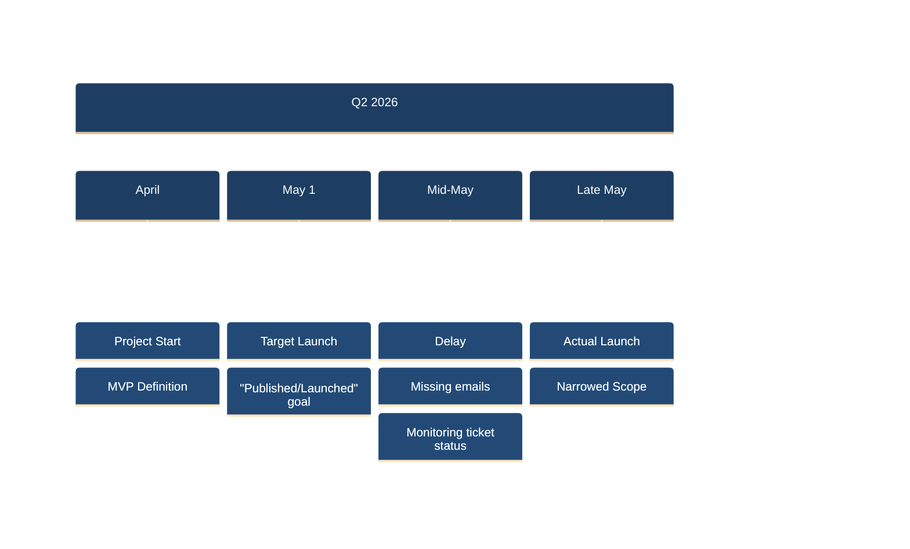
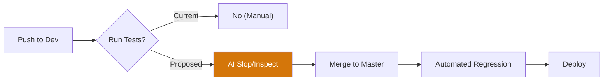
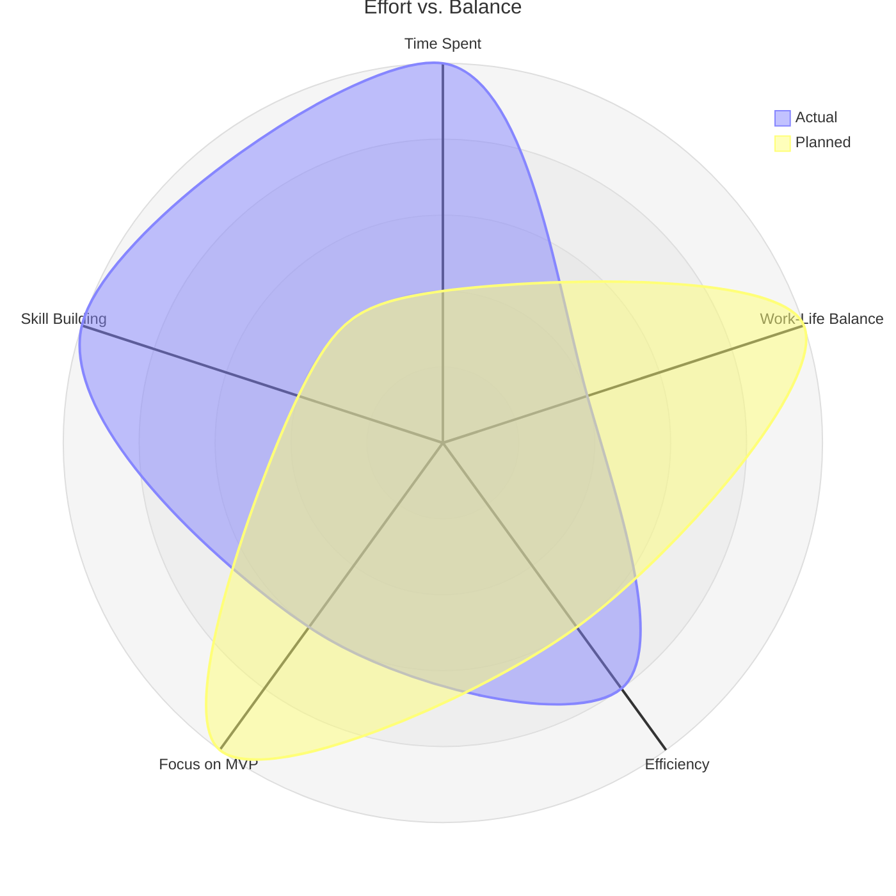
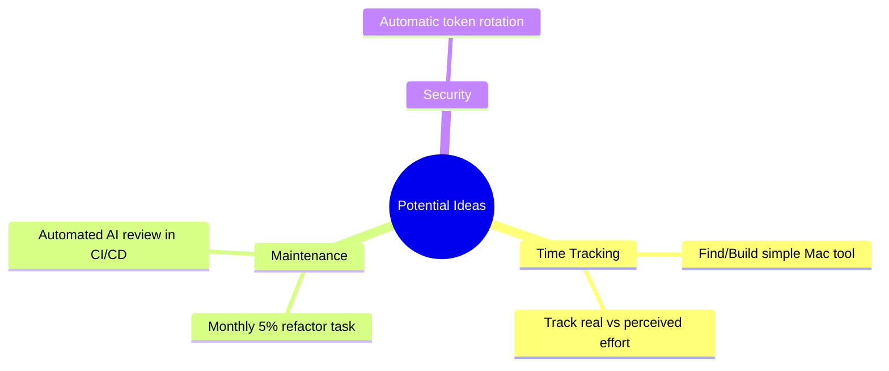
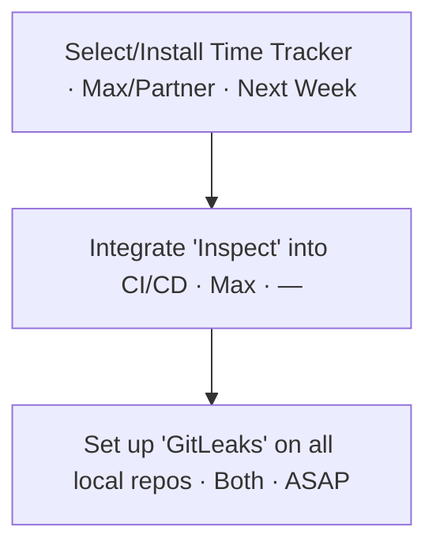

# Agile Retrospective: Retro Note v5

**Project:** Plugin MVP · **Date:** 2026-06-14 · **Participants:** Max, Colleague · **Duration:** ~45 min

---

---

## Launch Timeline & Scope
**TL;DR:** Launch delayed by 2 weeks due to communication gaps and initial scope creep; narrowed MVP was the right call.

<!-- alt: Timeline showing project start in April, May 1st target, and eventual launch delay. -->

Details

*   **Scope Management:** Initially took on too much; narrowing functional scope saved the project from further stretching.
*   **Bottlenecks:** A week was lost because an email notification wasn't seen; learned to monitor the URL/ticket status directly.
*   **Complexity:** Launching in a "closed ecosystem" (Atlassian/Marketplaces) revealed more hurdles than expected (Advanced/Standard versions).

---

## Development Workflow & CI/CD
**TL;DR:** Debate over running tests on every 'push' to dev vs. 'merge' to master; consensus on automation over manual review.

<!-- alt: Flowchart of the proposed CI/CD pipeline from push to deploy. -->

Details

*   **Test Frequency:** Arguments for tests on 'push' to see failures early; counter-argument that too many dependencies slow down development.
*   **AI Tooling:** Currently using `AI Slop` (pattern analysis) and `Inspect` (AI-driven code review via API).
*   **Self-Hosting:** Successfully using Tailscale for shared access and self-hosted server for history tracking.

---

## Security & Reliability
**TL;DR:** Shift toward "MFA everywhere" and automated secret scanning to prevent token leaks.

| Strategy | Tool/Method | Goal |
| :--- | :--- | :--- |
| **Secret Scanning** | `GitLeaks` | Block commits containing keys |
| **Access Control** | `MFA` | Multi-factor for all accounts |
| **Token Safety** | Rotation | Periodic rotation of all prod keys |

Details

*   **Automation:** "Don't include the brain" in repetitive security tasks—automate it so it's on "auto-pilot."
*   **Local Hooks:** Using pre-commit/pre-push hooks for linting and security scanning to catch issues before they hit GitHub.

---

## Time Management & Balance
**TL;DR:** Team significantly exceeded the 4h/week commitment, sometimes hitting 4h/day; need for better time-boxing.

<!-- alt: Radar chart showing the balance between planned and actual time usage. -->

Details

*   **Underestimation:** Practice showed effort was several times higher than abstract estimates.
*   **"Skill vs. Project":** Often spending time building reusable "skills" or universal tools rather than the project itself.
*   **Burnout Risk:** Late nights (until 10 PM) aren't efficient; necessity to apply professional time-management to personal projects.

---

## Ideas
**TL;DR:** Brainstormed improvements for tracking and maintaining the codebase.

<!-- alt: Mindmap of ideas for future retros. -->

Details

*   **Refactoring:** Allocate specific time (e.g., 5% or one task a month) for "Refactoring/Security" review rather than doing it ad-hoc.
*   **Tracker:** Use a simple tray-based tool (like one used previously on Windows) to track task switching.

---

## Actions
**TL;DR:** Immediate steps to improve workflow efficiency and security.

<!-- alt: Numbered flowchart for committed action items. -->

Details

1.  **Tracker:** Research and select a simple time-tracking tool (preferably Open Source/Self-hosted).
2.  **CI/CD:** Move AI inspection from local hooks to the pipeline to save local time.
3.  **Discipline:** Commit to "1 hour per workday" with strict time-boxing to avoid burnout.

---

## Appendix: Options Considered
| Choice | Decision | Rationale |
| :--- | :--- | :--- |
| **Tests on Push** | Postponed | Risk of slowing down small commits |
| **Custom Tracker** | Buy/Find first | Writing a tracker is a "distraction" from the MVP |
| **Direct URL Monitor** | Adopted | Email notifications are unreliable |

