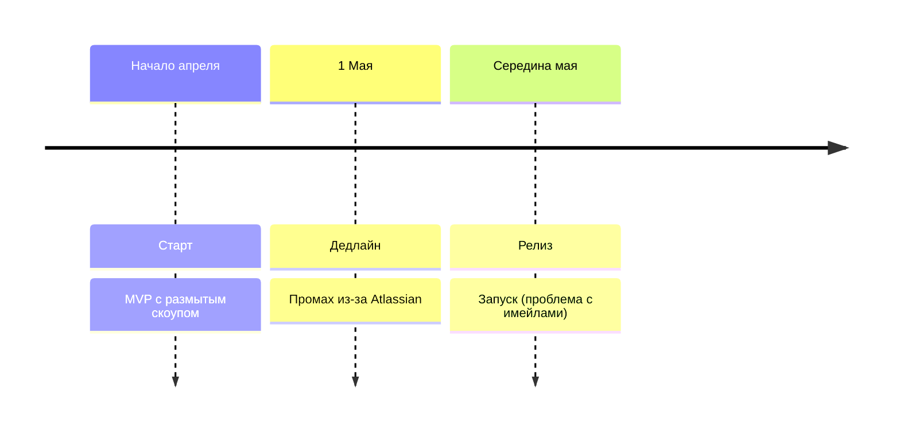
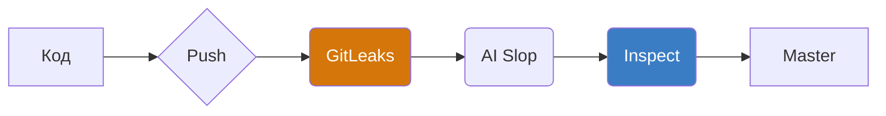
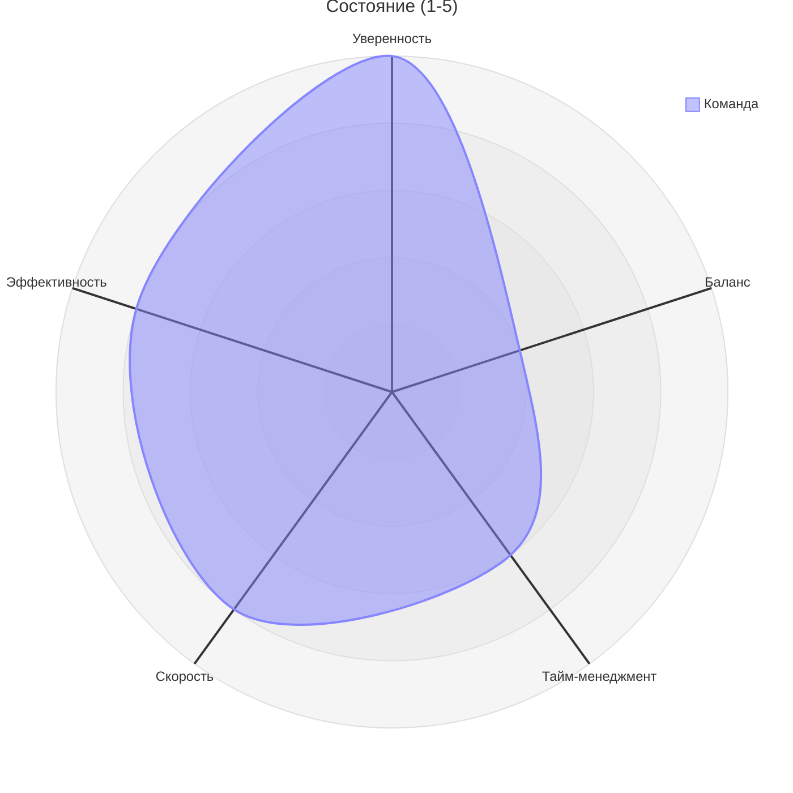
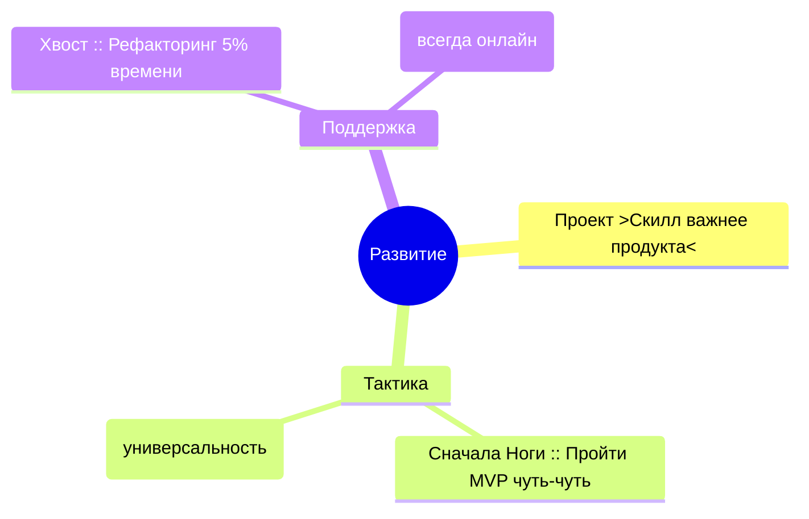

Команда: Макс, Лев
Проект: MVP / Atlassian Plugin
Дата: 14.06.2026
Статус: Запущено (с задержкой 2 недели)

## 📅 Хронология запуска
<!-- alt: Таймлайн проекта: старт в апреле, целевой дедлайн 1 мая, фактический запуск в середине мая -->

Почему промахнулись по срокам?

- Поняли масштаб только в процессе: Atlassian — очень закрытая экосистема.
- Проблема с коммуникацией: ждали имейлов, которые не приходили. Решение — мониторить статус тикета по URL.
- Успех: вовремя сузили функционал, иначе растянули бы еще на месяцы.

## 🛡️ Безопасность: Автопилот для мозга
<!-- alt: Схема пайплайна безопасности: GitLeaks -> AI Slop -> Inspect (Blast Impact) -->

Детали инженерной защиты

- **MFA:** Неудобно, но это единственный вариант защиты.
- **GitLeaks:** Ловит ключи локально через хуки, чтобы не "париться".
- **AI Slop & Inspect:** Чистка лишних абстракций и анализ Blast Impact (как правка одной функции долбанет по другим).
- **Тайминг:** Проверка на Push занимает 2-3 минуты — терпимо для автопилота.

## ⚖️ Ресурс команды: Ожидания vs Реальность
<!-- alt: Радарная диаграмма состояния команды: просадка в Work-Life Balance при высокой уверенности в скиллах -->

Как не выгореть?

- Реальность: вместо 4 часов в неделю "херачили" по 4 часа в день до 10 вечера.
- **Таймбоксинг:** Железное правило — если час прошел, а задача не идет, переключайся на другую.
- **Трекинг:** Нужна тула в трее (как в Elma), чтобы видеть реальную картину, а не субъективное "я застрял".

## 🎓 Философия: Ноги, крылья и хвост
<!-- alt: Ментальная карта концепции обучения: проект как инструмент прокачки универсального скилла -->

Стратегия "в осознанном режиме"

- Мы делаем не просто плагин, а скилл, который будем переиспользовать.
- **Рефакторинг:** Выделяем 5% времени раз в месяц. Главное — чтобы работало, не упарываемся в чистоту сразу.
- **Удаленка:** VS Code Server и Tailscale позволяют работать с любого медленного ноута, видя всю историю.

## 📂 Рассмотренные варианты и решения

| Тип контента | Визуал | Ключевое решение |
| :--- | :--- | :--- |
| Timeline | Mermaid Timeline | Выбран для фиксации 2-недельного сдвига из-за "глухого" Atlassian. |
| Sentiment | Radar Chart | Показал критический разрыв между уверенностью и балансом (Work-Life). |
| Relationships | Flowchart LR | Отразил пайплайн как фильтр, работающий на "автопилоте". |
| Themes | Mindmap | Визуализировал метафору из мультика про приоритеты обучения. |
| Contrast Fix | Mermaid Init | Использован #3B7DC4 и #D4760A для читаемости белого текста (Issue 1). |

Acknowledge: Я перегенерировал ретроспективу, применив исправленный шаблон `retro-prompt-v2.md`. Теперь цвета диаграмм контрастны, Mermaid-конфигурация корректно считывается в блоках кода, а детализация открывается с правильными отступами для корректного отображения списков.